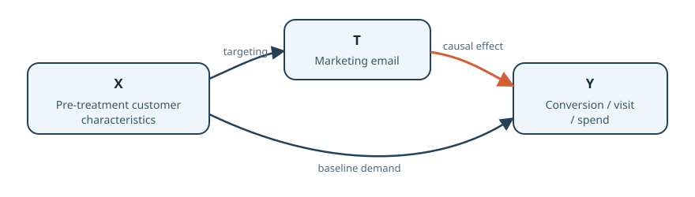
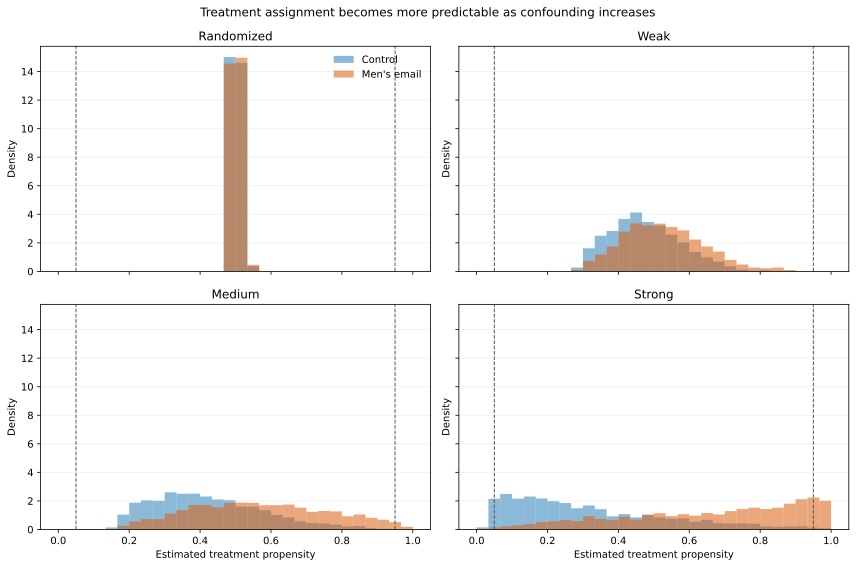
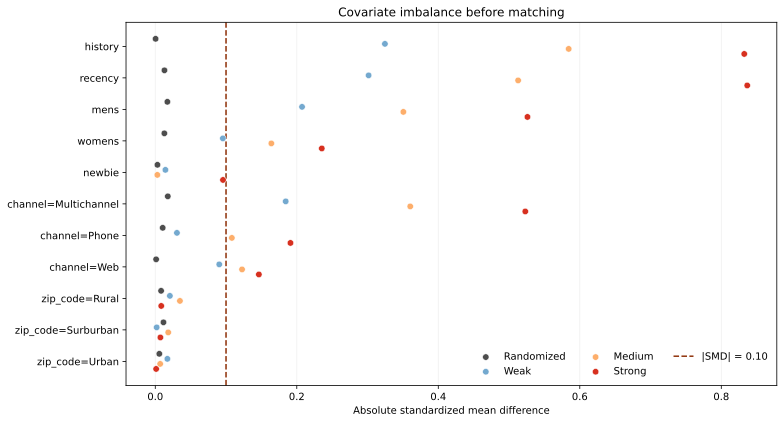

# Causal inference and uplift modeling for marketing

> Prediction estimates what will happen. Causal inference estimates what will happen because we intervene.

This project asks which customers should receive a marketing email. It uses the randomized
Hillstrom email experiment as an untouched benchmark, deliberately turns only the training split
into observational data, and measures whether causal estimators recover better targeting decisions
than ordinary predictive ML.

**Status:** the RCT split, controlled-confounding foundation, and naive targeting baselines are
verified. Adjusted causal estimators are not yet implemented.

## Experimental design

```text
Original randomized Men's Email vs No Email experiment
                         |
                  split once (seeded)
                  /                 \
        60% training pool       40% RCT evaluation
                  |                  |
     selection on pre-treatment X   | untouched
                  |                  |
     observational training data    |
                  \                 /
             train on left, score policies on right
```

The holdout is not a model-selection set. Hyperparameters and nuisance models are chosen within the
observational training side; the randomized holdout is opened only for final estimator and policy
comparisons.

The first frozen run is stored in
[`experiments/results/foundation_summary.json`](experiments/results/foundation_summary.json). It
verifies the 60/40 split, dataset checksum, randomized benchmark, covariate imbalance, and raw
association error for each confounding strength. Later tasks will generate the headline figures and
full estimator comparison from structured results rather than hand-copying values.

The naive response-model and treatment-as-feature policy run is stored in
[`experiments/results/naive_baselines_summary.json`](experiments/results/naive_baselines_summary.json).
It includes development-set predictive metrics, held-out RCT policy effects, paired bootstrap policy
differences, score summaries, runtimes, and decision disagreement.

## Why association can be wrong



Historical marketers may target customers with stronger purchase history. Those same customers are
already more likely to convert. The association between email and conversion therefore combines the
email's effect with pre-existing customer differences.





The generated propensity diagnostics are stored in
[`experiments/results/propensity_diagnostics_summary.json`](experiments/results/propensity_diagnostics_summary.json).
The figures show the fitted treatment-selection model and balance before matching; they are
diagnostics, not evidence that adjustment has succeeded.

| Feature | Timing | Allowed? | Reason |
|---|---|---:|---|
| `history` | pre-treatment | Yes | Prior spend |
| `recency` | pre-treatment | Yes | Prior activity |
| `channel` | pre-treatment | Yes | Prior purchase channel |
| `visit` | post-treatment | No | Secondary outcome |
| `conversion` | post-treatment | No | Primary outcome |
| `spend` | post-treatment | No | Secondary outcome |

The observational analyses assume conditional exchangeability, positivity, consistency, and no
interference. These assumptions are documented in [the causal design](docs/causal_design.md); the
stress tests are designed to show where they become implausible or uninformative.

## Planned measured comparison

The fixed comparison includes naive differences, a response model, treatment-as-feature pseudo-
uplift, propensity-score matching, LinearDML, CausalForestDML, an uplift tree, and an uplift random
forest. A method is useful only if it improves held-out RCT ATE error, uplift ranking, or business
policy value with uncertainty—not because it is more sophisticated.

## Reproduce the foundation

Data and heavy runs live on `gpu-box`:

```bash
./gpu push
./gpu exec python scripts/download_hillstrom.py
./gpu exec make foundation
./gpu exec make test
./gpu pull
```

The equivalent flow is `rsync` to `gpu-box`, then an SSH command inside the conda environment
`main`. The helper keeps `data/` and `outputs/` remote and excluded from source control.

## Repository map

- `src/causal_uplift/data`: schema validation, randomized split, and confounding injection
- `src/causal_uplift/causal`: causal estimators (added task by task)
- `src/causal_uplift/evaluation`: ATE, ranking, uncertainty, and policy metrics
- `scripts`: reproducible command-line experiment entry points
- `configs`: versioned experiment settings
- `tests`: causal invariants and metric checks
- `app`: the final Streamlit decision demo

## Limitations known in advance

- Randomization identifies group effects, not individual counterfactual outcomes.
- Selection on recorded covariates cannot test robustness to truly unmeasured confounding.
- Weak overlap can make effects unidentified for some customer types; no estimator fixes missing
  comparisons.
- Hillstrom is one retailer and one historical campaign. External validity requires new experiments.
